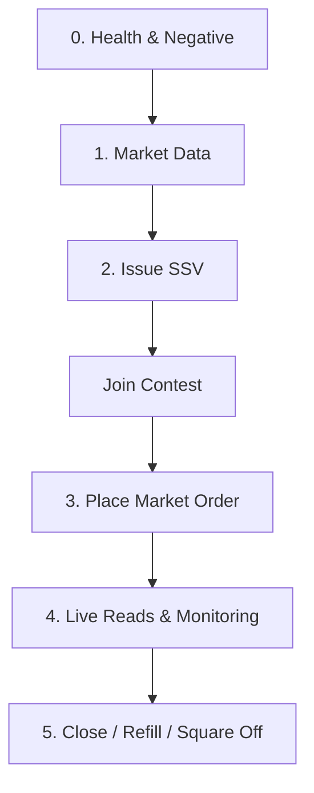

# TradeFantasy API Collection

Welcome to the **TradeFantasy API Collection** repository! This directory contains an OpenCollection / Bruno workspace with pre-configured requests, environment variables, validation tests, and WebSocket connections for interacting with the **TradeFantasy Engine API**.

## 📂 Project Structure

The workspace is defined by the [workspace.yml](file:///C:/Users/GauravJatt/Desktop/team-codes/tradefantacy-api-collection/workspace.yml) configuration file at the root. The collection structure is organized as follows:

```
tradefantacy-api-collection/
├── workspace.yml                       # OpenCollection workspace configuration
├── README.md                           # Documentation (this file)
└── tradeFantasy-engine-api/            # The main API collection
    ├── opencollection.yml              # Collection-level scripts, auth, and setup info
    ├── environments/
    │   └── local.yml                   # Environment variables for local development
    ├── 0. Health & Negative/           # Health checks for root, admin, quote, and user routes
    ├── 1. Market Data/                 # Candlestick history, instruments, and asset price feeds
    ├── 2. SSV & Join/                  # SSV generation and contest joining
    ├── 3. Trading/                     # Orders (market, limit, SL/TP), position management, and settling
    ├── 4. Live Reads/                  # Current positions, leaderboard, and user wallets
    └── 5. Settled - Historical Reads/  # Historical journal entries, player scores, and contest results
```

---

## 🛠️ Getting Started

### 1. Download & Install Bruno
We recommend using **Bruno**, an open-source, git-friendly API client.
* **Official Website**: [usebruno.com](https://www.usebruno.com)
* **Downloads**: [usebruno.com/downloads](https://www.usebruno.com/downloads)

### 2. Prerequisites
Ensure you have the following services running locally before testing:
* **Local Server**: The TradeFantasy engine server running (typically via `pnpm dev` on port `5000`).
* **Redis**: Make sure local Redis is active (required for SSV generation and contest joining).

### 3. Loading the Collection in Bruno (Recommended Usage)
To open and use this collection:
1. Open the **Bruno** desktop application.
2. Click **"Open Collection"** on the home screen.
3. Browse to the root of this repository and select the [tradeFantasy-engine-api](file:///C:/Users/GauravJatt/Desktop/team-codes/tradefantacy-api-collection/tradeFantasy-engine-api) folder.
4. Select the **"local"** environment from the environment dropdown in the top-right corner to load pre-configured variables (such as `baseUrl`, `wsUrl`, and `token`).

---

## 🔑 Variables & Environments

This collection is pre-configured with a **local** environment. Active configuration details can be found in [local.yml](file:///C:/Users/GauravJatt/Desktop/team-codes/tradefantacy-api-collection/tradeFantasy-engine-api/environments/local.yml).

### Collection Variables

| Variable | Default / Source | Description |
| :--- | :--- | :--- |
| `baseUrl` | `https://tradefantacy-engine.dev` (Local: `http://localhost:5000`) | Base API endpoint URL |
| `wsUrl` | `ws://tradefantacy-engine.dev/ws` (Local: `ws://localhost:5000/ws`) | WebSocket connection endpoint |
| `token` | Mock Bearer Token | User auth token (automatically sent via headers) |
| `contestId` | `2` | ID of the active target contest |
| `userRef` | Derived / `player-001` | Reference for testing user actions |
| `ssvToken` | *Captured dynamically* | Generated via the `Issue SSV` request |
| `positionId` | *Captured dynamically* | Generated via the `Place Market Order` request |

---

## 🔄 Recommended Chained Run Order

For testing the complete trading life cycle automatically, follow this chained execution order:



1. **Verify Health**: Run `Root (engine health)` to make sure the server is responsive.
2. **Retrieve Market Data**: Query symbol prices and instruments.
3. **Issue SSV Token**: Run `Issue SSV`. This automatically extracts the `ssvToken` and updates your workspace variables.
4. **Join Contest**: Use the captured `ssvToken` to register the test player in the specified contest.
5. **Place Orders**: Open positions by running `Place Market Order` or `Place Pending Order`. Opening a position automatically extracts the `positionId` variable.
6. **Read Live State**: Monitor wallets, positions, and live leaderboards.
7. **Close/Settle**: Test closing positions, refilling wallets, or squaring off the contest to view settled results.

---

## ⚠️ Notes & Tips

* **Response Delays**: The mock authentication setup adds a ~5s delay on requests. Delayed responses are expected during early testing.
* **Risk Engine Loops**: Liquidation, SL/TP triggers, and pending limit orders won't process autonomously until the background risk loop worker is fully resolved.
* **User Reference Validation**: Until authentication route parsing is completed, `userRef` is sent in request bodies.
